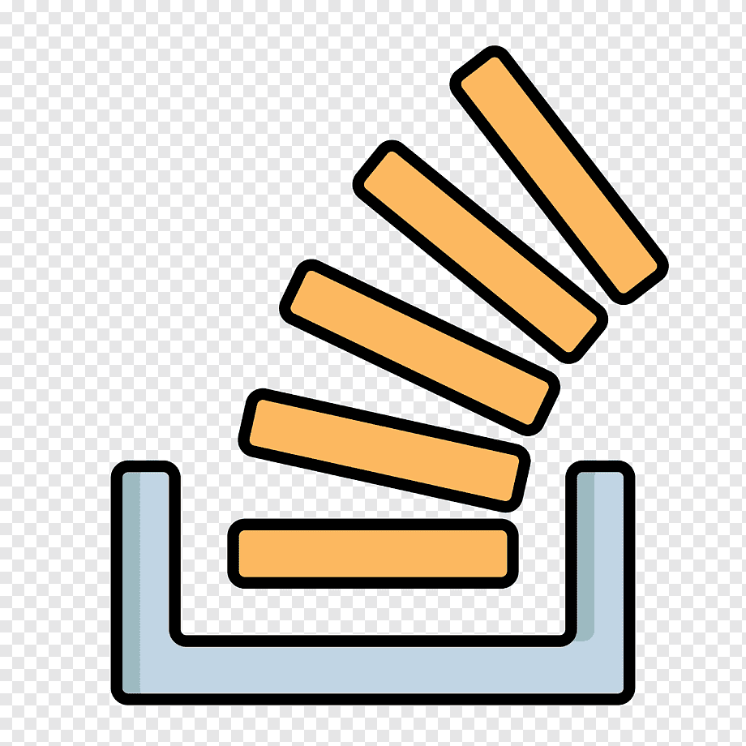

<h1 align="center">Hi, I am Muhammad Kamran Syed</h1>
<h3 align="center">I am a seasoned IT professional, interested in exploring Data Science, Machine Learning, Blockchain, Metaverse and Frontend Development. I am originally from Pakistan but have worked all across the middle east Qatar, Kuwait, Dubai, Bahrain and Saudi Arabia.</h3>

  <h3> 📫 Contact me: 
    
    
  </h3>

<h3 align="left">Connect with me:</h3>

  
  
  
  
  
  

<h3 align="left">Languages and Tools:</h3>

                              

GitHub Statistics :zap: : 

 
  

 

 

 

 

